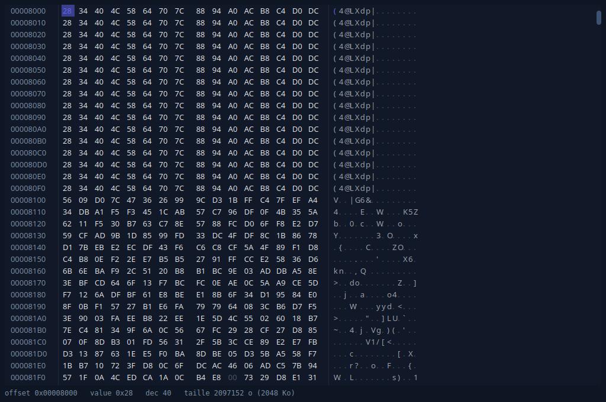
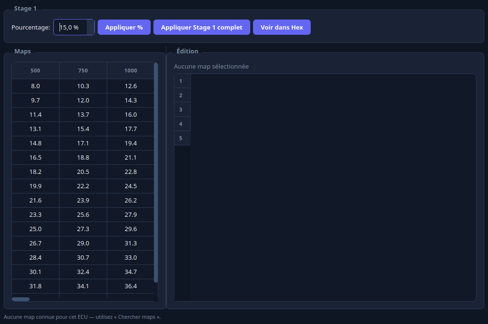
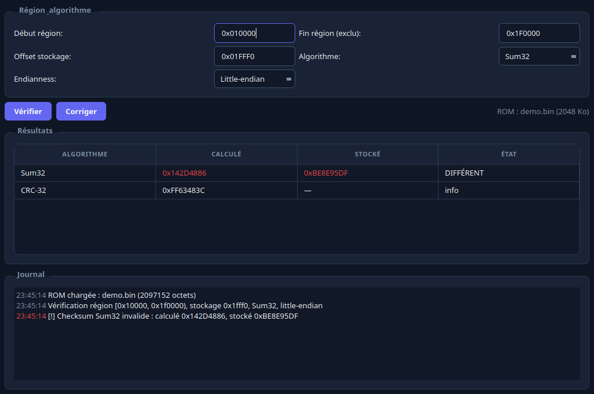
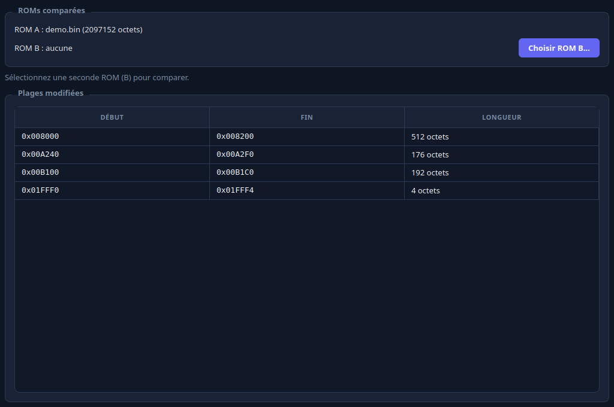
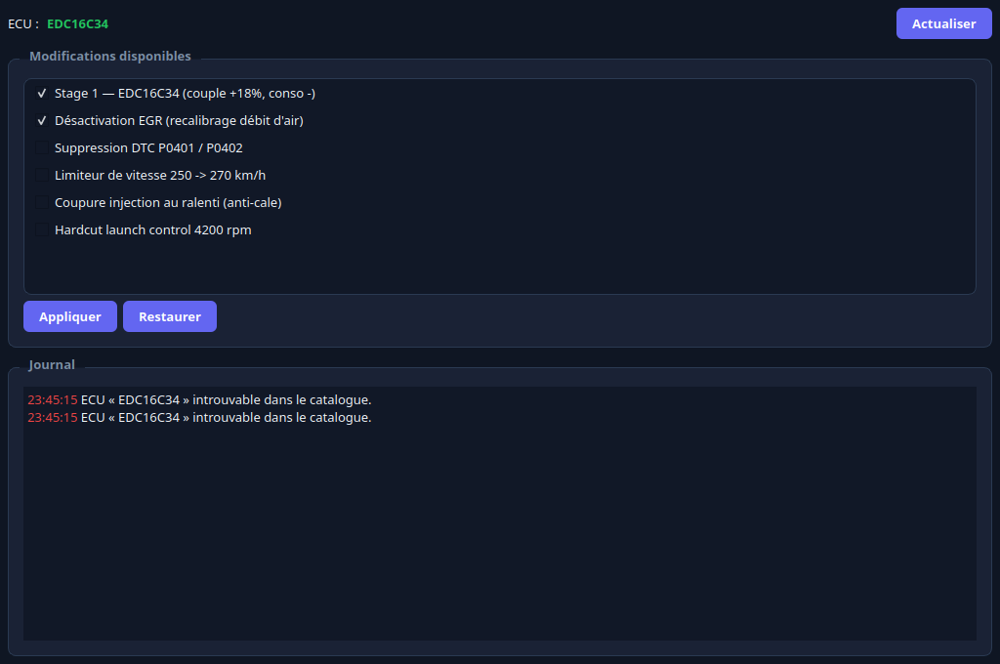
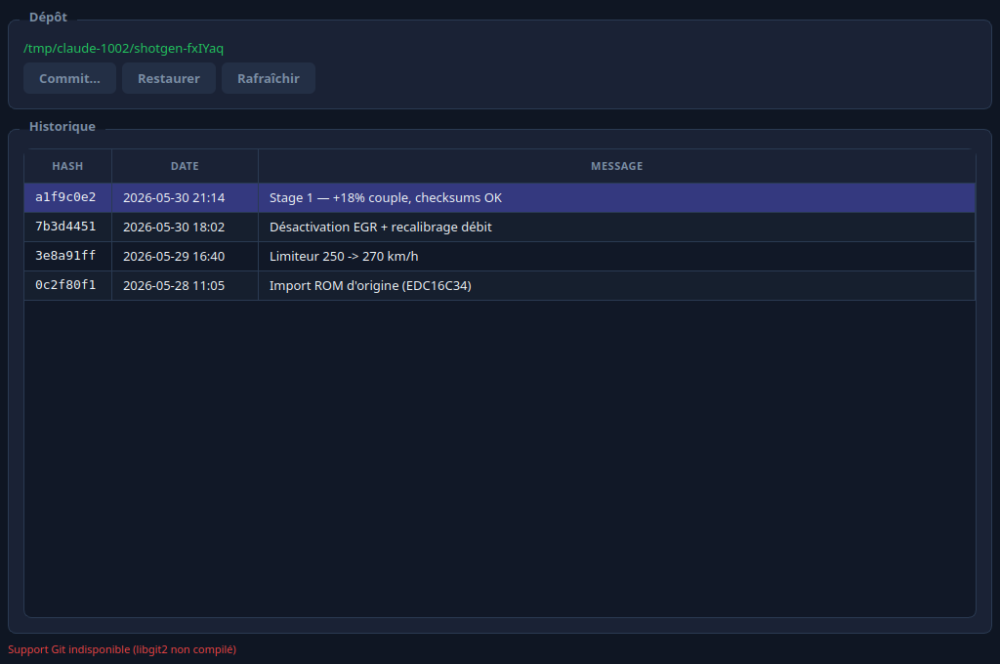
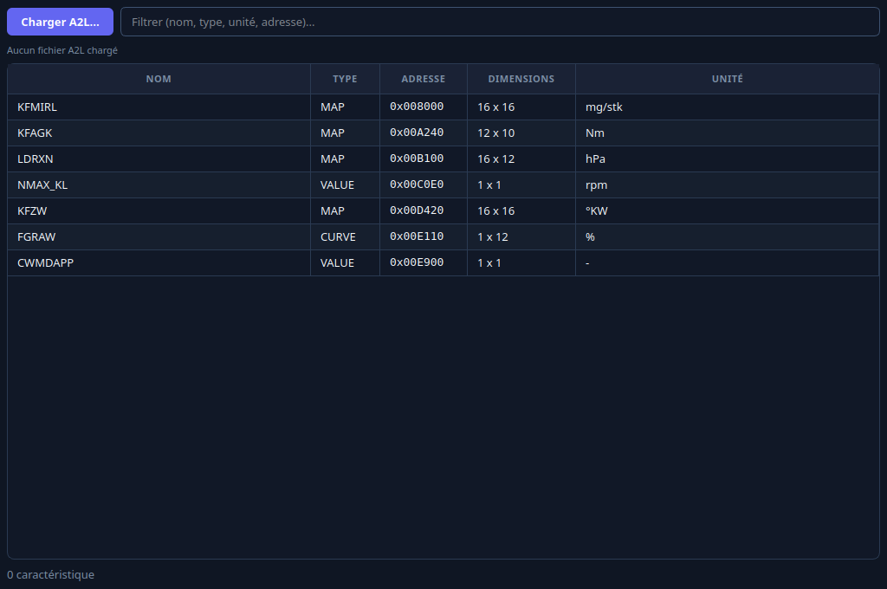
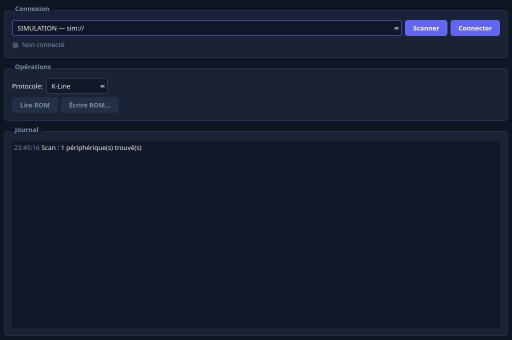
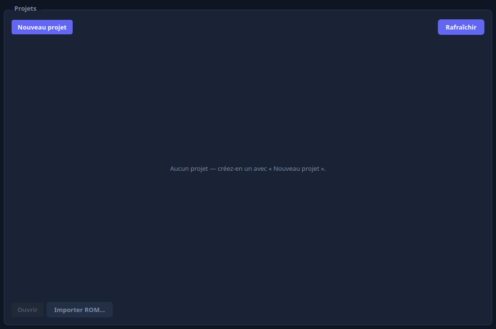

# ECU Studio Suite — Qt6/C++23 automotive ECU reprogramming platform

100% local, no telemetry, no network calls. Linux-native with SocketCAN and libusb, Windows cross-compile supported.

**Website:** https://poisson48.github.io/ecu_studio_suite/

Part of the **ECU Studio Suite** alongside **[SocketSpy](https://github.com/Poisson48/SocketSpy)** — the Linux CAN bus analysis platform.

---

## Download

[](https://github.com/Poisson48/ecu_studio_suite/releases/latest)

**[⬇ Download ECU Studio (AppImage)](https://github.com/Poisson48/ecu_studio_suite/releases/latest/download/ECU_Studio-x86_64.AppImage)** — v1.3.0, ~37 MB, Linux x86_64

Then make it executable and run it:

```bash
chmod +x ECU_Studio-x86_64.AppImage
./ECU_Studio-x86_64.AppImage
```

Self-contained AppImage — Qt6, libusb and every runtime library are bundled, so it runs on a clean PC with **nothing installed** and no root access needed. Just download, `chmod +x`, and run. All [releases](https://github.com/Poisson48/ecu_studio_suite/releases/latest) are on GitHub.

> Prefer to build it yourself? See **[Build from source (developers)](#build-from-source-developers)** below.

---

## What's inside

| Component | Description |
|-----------|-------------|
| `apps/ecu-studio` | Main ECU tuning application — ROM read/write, hex editor, map editor, A2L parser, git versioning |
| `apps/socketspy` | SocketSpy submodule — CAN spy companion tool, UI theme and sidebar shared with ECU Studio |
| `libs/mpps` | USB driver for MPPS V21 programmer (FTDI-based, libusb on Linux, simulation mode) |
| `libs/ecu-core` | C++23 port of `open_car_reprog` — EcuCatalog, RomPatcher, MapFinder, A2lParser, GitManager… |
| `libs/can-core` | Thin alias over SocketSpy's CAN core (SocketCAN, protocol decoders) |
| `libs/shared` | Shared Qt6 utilities and color palette |
| `tools/reverse` | Reverse engineering tools for the MPPS V21 protocol (ftd2xx proxy DLL, `identify_exe.py`) |

---

## Screenshots

> Full gallery: **https://poisson48.github.io/ecu_studio_suite/demo.html**

| Hex editor | Map editor | Checksum |
|:---:|:---:|:---:|
| [](docs/screenshots/es_hex.png) | [](docs/screenshots/es_maps.png) | [](docs/screenshots/es_checksum.png) |

| ROM compare | AutoMods | Git versioning |
|:---:|:---:|:---:|
| [](docs/screenshots/es_compare.png) | [](docs/screenshots/es_automods.png) | [](docs/screenshots/es_git.png) |

| A2L browser | MPPS flashing | Project manager |
|:---:|:---:|:---:|
| [](docs/screenshots/es_a2l.png) | [](docs/screenshots/es_mpps.png) | [](docs/screenshots/es_project.png) |

---

## Features

### ECU Studio (main app)

> **Status legend:** ✅ stable · ✨ new in v1.3.0 · 🔜 beta / coming soon

- ✅ **ROM read / write** — full-ROM and block-level flash via MPPS V21 over USB; progress bar, abort
- ✅ **Hex view** — fast hex editor with search, byte-level diff overlay, address jump
- ✅ **Map editor** — 2-D map visualization; edit scalar, curve, and table maps; import/export CSV
- ✨ **DAMOS editor** — create and edit `open_damos` definitions in-app: add/remove characteristics, edit fields, detect maps from a ROM, manage one-click AutoMods, export A2L
- 🔜 **3D map view** — pseudo-3D surface + heatmap with *ghost* baseline overlay (compare original vs modified) works today; native OpenGL `Q3DSurface` rendering is coming soon (the AppImage currently uses the QPainter renderer)
- ✅ **A2L parser & export** — parse ASAP2 `.a2l` files; browse measurements/characteristics by ECU, and export relocated `open_damos` maps to standard A2L
- ✅ **Checksum panel** — compute and patch checksums for supported ECU families
- ✅ **Compare panel** — side-by-side diff of two ROM files; byte-level delta, filterable by region
- ✅ **AutoMods panel** — apply named calibration patches from a JSON recipe; batch apply / revert
- ✅ **Git versioning** — libgit2-backed ROM history; commit any state, browse the commit log, restore (roll back) any previous version straight into the editor
- ✅ **Project manager** — `.ecuproj` project files with ROM path, ECU type, notes, and flash log
- ✅ **CAN companion** — launch SocketSpy side-by-side for live CAN monitoring during reprogramming
- ✨ **In-app auto-update** — the AppImage checks GitHub for new signed releases and updates itself in place (Ed25519-signed manifest + SHA-256 verification)
- ✨ **Brand identity & bilingual UI** — new ECU Studio logo and complete French/English translations (the bundled `open_damos` EDC16C34 definition is now fully in English)

### MPPS V21 driver (`libs/mpps`)

- K-Line and CAN physical protocols; configurable bitrate
- Block read / write / erase with progress callback
- Hardware checksum verification
- Simulation mode (`-DECU_MPPS_SIMULATION=ON`) — no hardware required for UI development and CI
- Protocol logging (`-DECU_MPPS_PROTOCOL_LOG=ON`) — dumps all frames for reverse-engineering capture

### ECU core (`libs/ecu-core`)

| Module | Description |
|--------|-------------|
| `EcuCatalog` | SQLite-backed ECU database: VIN lookup, ECU model, supported protocols |
| `RomPatcher` | Apply binary patches by address range; checksum-aware |
| `MapFinder` | Heuristic map detection in raw ROM dumps |
| `MapDiffer` | Structural diff of two ROM maps |
| `A2lParser` | Full ASAP2 parser (characteristics, measurements, record layouts) |
| `ProjectManager` | `.ecuproj` read/write and migration |
| `VehicleTemplates` | Pre-built vehicle / ECU profiles |
| `OpenDamos` | OpenDamos ECU definition import |
| `GitManager` | libgit2 wrapper — commit, diff, log, blame (optional, requires libgit2) |

### Supported ECUs

| ECU | Protocol | Notes |
|-----|----------|-------|
| EDC16C34 | K-Line | Bosch diesel — Peugeot / Citroën |
| ME7.x | K-Line | Bosch petrol |
| MED17 | CAN (UDS) | Bosch petrol — direct injection |
| EDC17 | CAN (UDS) | Bosch diesel |

### Reverse engineering tools (`tools/reverse`)

- **`ftd2xx_proxy.c`** — drop-in Windows DLL proxy that logs every `FT_Write` / `FT_Read` call to reconstruct the MPPS USB protocol from a Windows capture session
- **`identify_exe.py`** — analyses an MPPS `.exe`: detects packers (UPX, Themida, VMProtect), compiler (Delphi, .NET, Qt), imports, and protocol strings; recommends the right decompiler (IDR, dnspy, Ghidra)
- **`parse_capture.py`** — parses raw ftd2xx log files and formats decoded MPPS frames

---

## Build from source (developers)

> Most users should just **[download the AppImage](#download)** above. Building from source is only needed for development or hacking on the code.

### Dependencies (Ubuntu / Debian)

```bash
sudo apt install \
    qt6-base-dev qt6-charts-dev qt6-serialbus-dev qt6-serialport-dev \
    libusb-1.0-0-dev libgit2-dev liblua5.4-dev \
    nlohmann-json3-dev libgtest-dev cmake ninja-build
```

### Quick build (simulation mode, no hardware required)

```bash
git clone --recurse-submodules https://github.com/yourorg/ecu-studio-suite
cd ecu-studio-suite
bash build.sh          # configure + build in ./build  (~1 min)
./build/apps/ecu-studio/ecu_studio
```

`build.sh` checks all dependencies before building and enables simulation mode by default.

### Manual CMake

```bash
# Simulation mode — no MPPS hardware needed
cmake -B build \
    -DCMAKE_BUILD_TYPE=Release \
    -DECU_MPPS_SIMULATION=ON \
    -DECU_BUILD_TESTS=OFF \
    -G Ninja

cmake --build build --target ecu_studio -j$(nproc)

./build/apps/ecu-studio/ecu_studio
```

### Full build with tests

```bash
cmake -B build \
    -DCMAKE_BUILD_TYPE=Debug \
    -DECU_MPPS_SIMULATION=OFF \
    -DECU_BUILD_TESTS=ON \
    -G Ninja

cmake --build build
ctest --test-dir build --output-on-failure
```

### CMake options

| Option | Default | Description |
|--------|---------|-------------|
| `ECU_BUILD_ECU_STUDIO` | `ON` | Build the ECU Studio GUI |
| `ECU_BUILD_SOCKETSPY` | `ON` | Build SocketSpy companion |
| `ECU_BUILD_TESTS` | `ON` | Build GTest unit and integration tests |
| `ECU_MPPS_SIMULATION` | `OFF` | Simulate MPPS — no real USB device needed |
| `ECU_MPPS_PROTOCOL_LOG` | `OFF` | Log all MPPS frames to stdout |

---

## Real hardware — Linux setup

```bash
# Allow non-root access to the MPPS V21 USB device
sudo cp libs/60-mpps.rules /etc/udev/rules.d/
sudo udevadm control --reload-rules && sudo udevadm trigger

# Plug in the MPPS V21, then run
./build/apps/ecu-studio/ecu_studio
```

The MPPS panel auto-detects the device. Hit **Refresh** after plugging in.

> **Note:** Linux uses libusb directly — no FTDI D2XX driver installation required. The `ftd2xx_proxy.c` tool is only needed for Windows protocol capture sessions.

---

## Project structure

```
ecu_studio_suite/
├── apps/
│   ├── ecu-studio/         Main ECU Studio application
│   │   ├── src/
│   │   │   ├── panels/     Feature panels (mpps, hex_view, map_editor, git, a2l, …)
│   │   │   └── main_window.cpp
│   │   └── i18n/           Qt translations (fr / en)
│   └── socketspy/          SocketSpy submodule (CAN spy, theme, sidebar)
├── libs/
│   ├── mpps/               MPPS V21 USB driver (libusb + simulation)
│   ├── ecu-core/           ECU business logic (catalog, patcher, parser…)
│   ├── can-core/           SocketCAN / protocol decoder alias
│   └── shared/             Qt6 palette and shared utilities
├── tests/
│   ├── unit/               GTest unit tests per module
│   ├── integration/        Integration tests (real or simulated hardware)
│   └── fixtures/           ROM fixtures and A2L samples
├── tools/
│   └── reverse/            MPPS protocol reverse engineering tools
├── cmake/                  CMake helper modules
├── build.sh                Quick build script
├── CMakeLists.txt
└── vcpkg.json              vcpkg manifest (nlohmann-json, libusb, libgit2, gtest, Qt6)
```

---

## ECU Studio Suite

This repository is one half of the **ECU Studio Suite**:

| Tool | Role |
|------|------|
| **ECU Studio** *(this repo)* | ROM reading, map editing, ECU flashing |
| **[SocketSpy](https://github.com/Poisson48/SocketSpy)** | Live CAN monitoring, UDS tester, protocol decoders, Lua scripting |

Both tools share the same Qt6 dark theme and sidebar navigation component. They are designed to be used together — ECU Studio launches SocketSpy for live CAN monitoring during reprogramming sessions.

---

## Platform support

| Platform | Status | Notes |
|----------|--------|-------|
| Linux x86_64 | Primary target | libusb, SocketCAN, full feature set |
| Windows (cross-compile) | Supported | MinGW toolchain; ftd2xx for MPPS on Windows |
| macOS | Not tested | SocketCAN unavailable |

Requires kernel ≥ 5.4 with SocketCAN support on Linux.

---

## License

GPL-3.0 — see [LICENSE](LICENSE).
